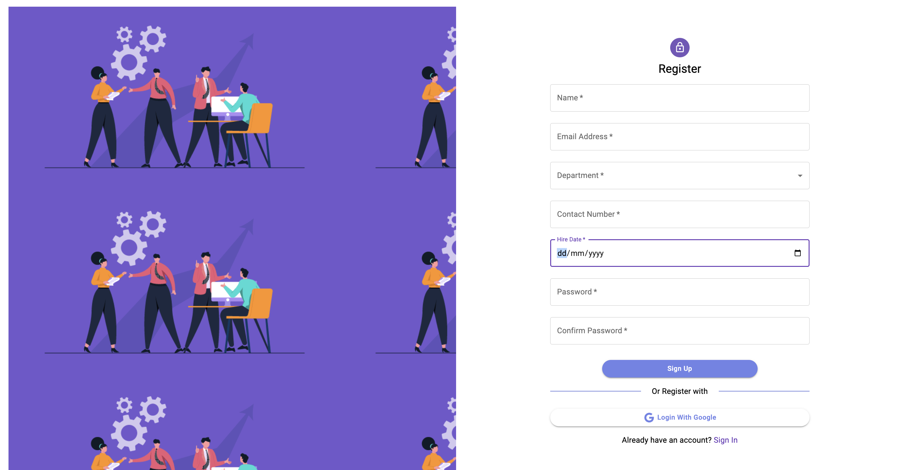
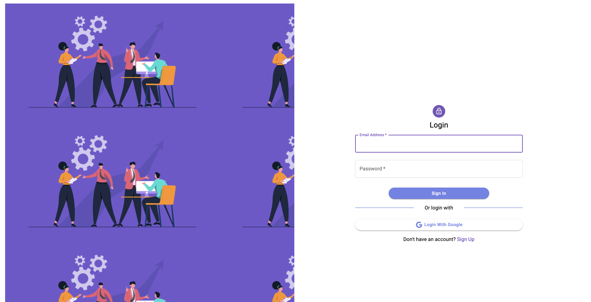
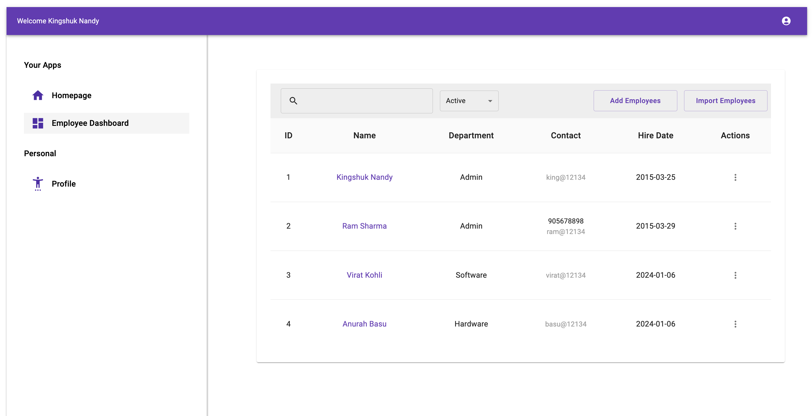

<html><center><h1>React Typescript Webpack Starter Template</h1></center></html>


UI Designs of different Applications using MaterialUI and CSS for React TypeScript Project

## Contents

- [Features](#features)
- List of UI Applications
  - [Employee Management](#employee-management)
  - [Social Networking Application](#social-networking)

## Features

- All the applications using its own Theme, which can be customized as per requirement

## Details of the Applications

### Employee Management

You will find the application [here](./src/feature/EmployeeManagement/)
The different screens looks like as follows:




### Social Networking

You will find the application [here](./src/feature/SocialNetworkApp/)


## Quick Start

- Install the dependencies

```cmd
  npm install
```

- Start the app in dev mode

```cmd
   npm start
```

- Build the app

```cmd
   npm run build
```

# References

- [Material UI React Tutorial | Material UI Responsive Project](https://www.youtube.com/watch?v=lKZiXQWnlUw)
